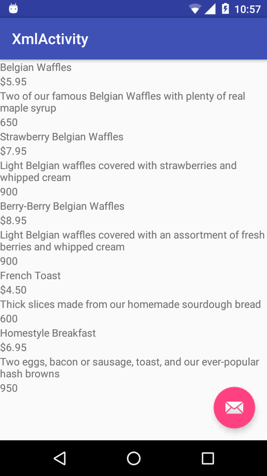
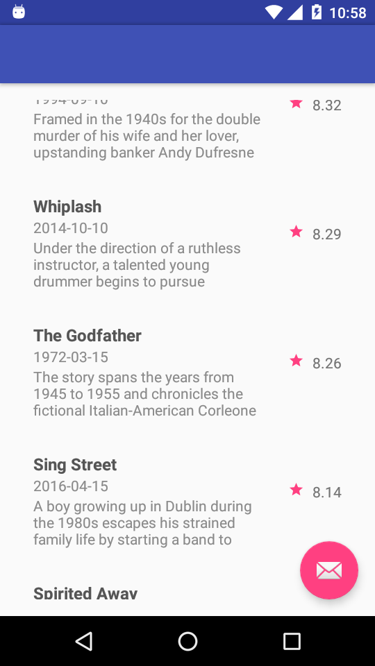

#  Retrofit

The best ways of calling server and taking response in JSON or XML format. retrofit make coding easy and very little you have to write code. The beast thing is that code is divided into MVP pattern. 
Retrofit include three things. 
 
 1. Retrofit Client 
 2. Retrofit Interface
 3. Retrofit Model
  
 ## Retrofit Client
 
 Retrofit client is a common class which request to the server with very basic information of request and response.
 
 ###  Request information
  
  URL thorugh it call the server.
 
 ### Response  information
   
   Type of Response , XML response or JSON response. 
  
 ## Retrofit Interface. 
   
   It include requesting parameters. Like 
   
   1.  body parameters 
   2 . header parameters 
   3. url mapers 
   
 ## Retrofit Model.
   
   Retrofit Model carry the information. It works as templates which is use to carry and represent the information. It works just like DNA of living cell.
   
## this screen for xml parsing 

</img>

## this screen is for json paring
 
</img>

Please go through the code than you will understand how retrofit works. If you have any problem or doubt or any enhancement request please open the issue.
  
  Thank you :) 
  
  Hope you enjoy the code.